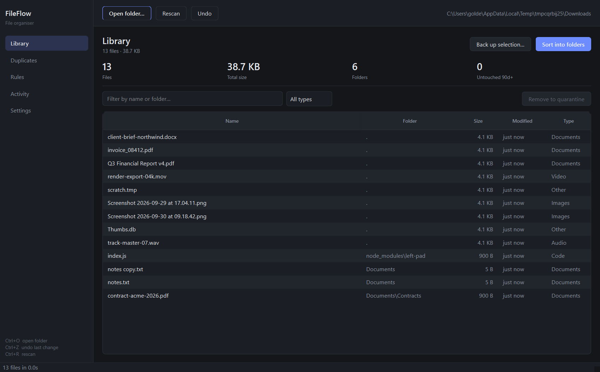
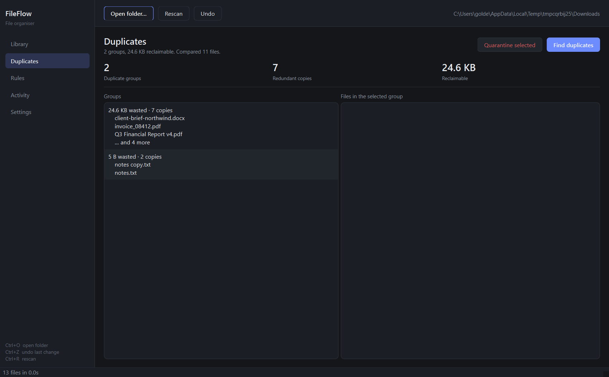
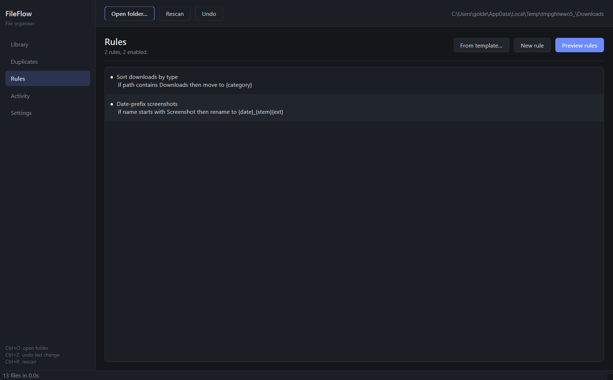
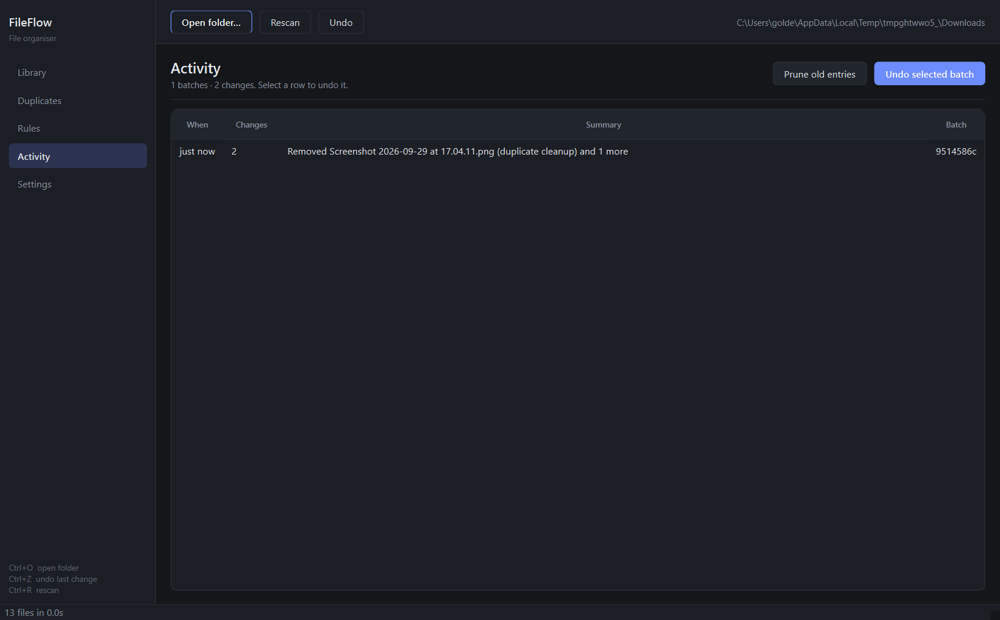
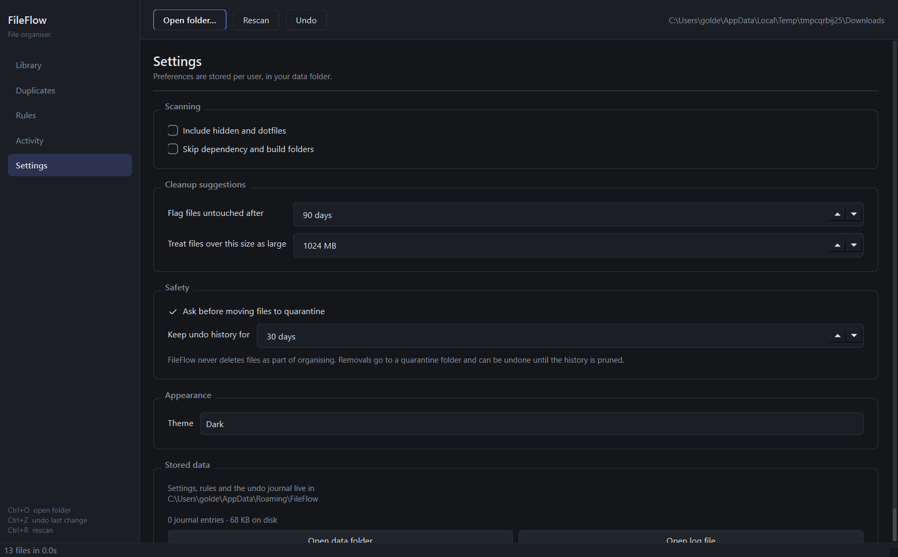

# FileFlow

A small Windows app for cleaning up messy folders. It reads a folder you point
it at, works out what is in there, and does the boring parts: sorting files by
type, finding copies you did not know you had, renaming batches, and clearing
out leftovers.

Everything it changes goes into a journal first, so any action can be undone.



## Why

I kept ending up with a Downloads folder holding 400 files, no idea what half
of them were, and three copies of the same PDF under slightly different names.
The tools that solve this are either far too clever about it or far too manual.

FileFlow does one thing: it reads a folder and tells you the truth about what
is in it, then does the obvious things about it. Every number it shows is
measured from your disk at the moment you press the button. Nothing is
estimated, and there is no account to create.

## Features

- **Read a folder** — recursive scan with size, type and modified time, filtering
  by name, folder or type
- **Sort by type** — move every file into a folder named after its category
- **Find duplicates** — compares by size first, then by SHA-256 of the contents,
  so it finds real duplicates rather than files that merely look alike
- **Bulk rename** — pattern based, with find-and-replace, and it will not
  overwrite an existing file to get there
- **Rules** — conditions and actions, previewed before anything happens
- **Cleanup suggestions** — leftover temp files, stale downloads, build
  directories, archives nobody has opened
- **Undo** — every change is journalled, per batch, for as long as you keep it
- **Quarantine instead of delete** — removing a file moves it to a quarantine
  folder, so undo is a move back and not a rescue from the Recycle Bin

## Screenshots

| | |
|---|---|
|  |  |
| Duplicates, grouped by the space they waste | Rules, in plain English |
|  |  |
| Activity, with undo per batch | Settings |

## Installation

Grab `FileFlow.exe` from the [releases page](https://github.com/stopcinning/FileFlow/releases)
and run it. No installer, no Python, no dependencies.

Windows will warn the first time you run it, because the executable is not
code-signed. Click *More info* → *Run anyway*.

### From source

Needs Python 3.11 or newer.

```bash
git clone https://github.com/stopcinning/FileFlow.git
cd FileFlow
python -m venv .venv
.venv\Scripts\activate
pip install -e ".[dev]"
```

Run it from source:

```bash
python -m fileflow
```

Build the executable yourself:

```bash
python scripts\build.py
```

## Quick start

1. Press **Open folder…** and pick something messy. `Downloads` is a good
   first target.
2. Look at the **Library** tab. The counts are real.
3. Try **Sort into folders** to file everything by type. Undo with `Ctrl+Z` if
   you do not like it.
4. Open **Duplicates** and press **Find duplicates**. It hashes file contents,
   which takes a moment on a large folder.

Nothing is modified until you press a button that says it will be.

## Organising rules

A rule is a set of conditions and one action. All conditions must be true for
the rule to fire.

**Conditions** can be on the file's name, extension, path, size or last
modified date. Supported comparisons:

| Field | Comparisons |
|---|---|
| Name | is, is not, contains, starts with, ends with, matches regex |
| Extension | is, is one of |
| Size | is larger than, is smaller than, is exactly |
| Last modified | days ago or more, days ago or fewer |
| Path | contains, starts with |

Sizes accept units: `500`, `500KB`, `1.5 GB`.

**Actions** are move, rename, both, or tag.

Rename and move destinations understand these tokens:

| Token | Becomes |
|---|---|
| `{name}` | full filename |
| `{stem}` | filename without extension |
| `{ext}` | extension, including the dot |
| `{date}` | modified date, `YYYY-MM-DD` |
| `{year}` `{month}` `{day}` | parts of that date |
| `{time}` | modified time, `HHMM` |
| `{index}` `{index:3}` | position in the batch, zero-padded |
| `{case:kebab}` | also `snake`, `lower`, `upper`, `title` |
| `{category}` | the detected type, in folder destinations |
| `{parent}` | name of the containing folder |

Write `{{` and `}}` for literal braces.

So `{date}_{stem}{ext}` turns `IMG_2231.jpg` into `2026-09-30_IMG_2231.jpg`, and
`{case:kebab}{ext}` turns `Quarterly Report.docx` into
`quarterly-report.docx`.

Rules are previewed before they are applied. The preview shows exactly which
file goes where, and nothing moves until you confirm.

## Keyboard shortcuts

| Shortcut | Action |
|---|---|
| `Ctrl+O` | Open a folder |
| `Ctrl+R` | Rescan |
| `Ctrl+Z` | Undo the last batch of changes |
| `Ctrl+F` | Focus the filter box |
| `Ctrl+1` … `Ctrl+5` | Switch tab |
| `Double-click` | Show a file in Explorer |
| `Right-click` | Context menu for the row under the pointer |

## Configuration

Settings, rules and the journal are stored per user:

| Platform | Location |
|---|---|
| Windows | `%APPDATA%\FileFlow\` |
| macOS | `~/Library/Application Support/FileFlow/` |
| Linux | `~/.local/share/FileFlow/` |

| File | Contents |
|---|---|
| `settings.json` | preferences; safe to edit by hand |
| `rules.json` | your rules, same format |
| `journal.db` | SQLite, the undo history |
| `fileflow.log` | rolling log, 512 KB × 3 |

Deleting `journal.db` discards the undo history. It does not touch your files.

## How it treats your files

- It never deletes anything as part of organising. "Remove" means move to
  `_FileFlow Quarantine/`.
- It writes a journal entry **before** moving anything, so a crash mid-operation
  still leaves a reversible record.
- The journal is written outside the folder being organised, so tidying a
  folder cannot destroy the log of what it did.
- Undo reverses a whole batch, newest change first, and reports anything it
  could not put back rather than pretending it succeeded.
- Purging the quarantine folder is the only thing that really deletes, and it
  refuses to touch paths outside that folder.

## Roadmap

Roughly in order. See [ROADMAP.md](ROADMAP.md) for detail.

- [ ] Bulk rename dialog with a live before/after preview
- [ ] Watch a folder and apply rules as files land
- [ ] Per-folder rule sets, so Downloads and Photos behave differently
- [ ] Export the activity log to CSV
- [ ] macOS build
- [ ] Clean up the quarantine folder from the UI

## Known issues

Listed in [KNOWN_ISSUES.md](KNOWN_ISSUES.md). The short version: Windows-only
for now, and files over 8 GB are skipped by duplicate detection.

## Contributing

Issues and pull requests are welcome. Start with
[CONTRIBUTING.md](CONTRIBUTING.md) — it covers the layout and the two rules
that matter (nothing deletes, everything is journalled).

## License

MIT. See [LICENSE](LICENSE).
